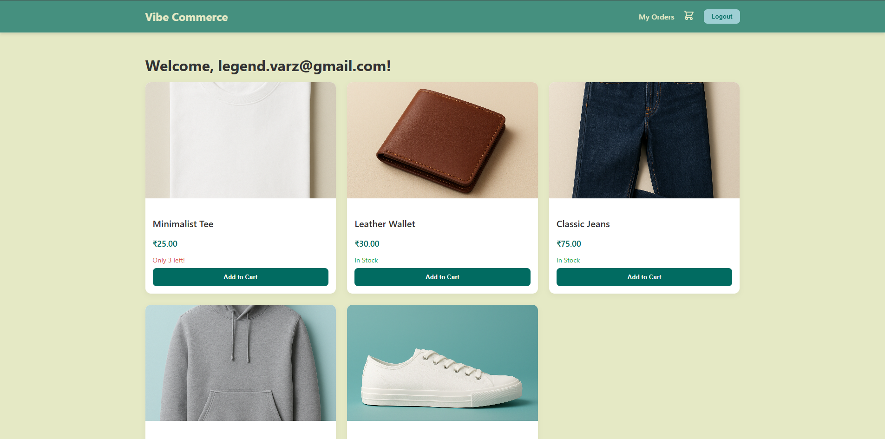
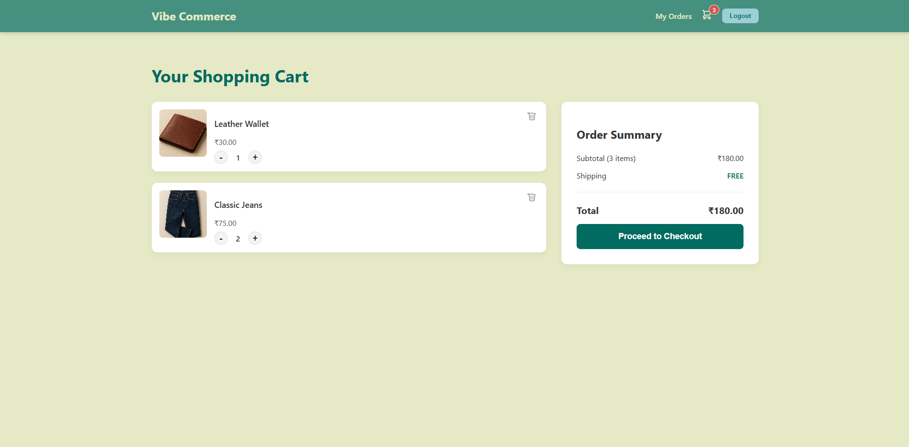
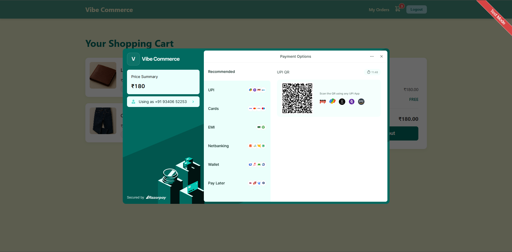
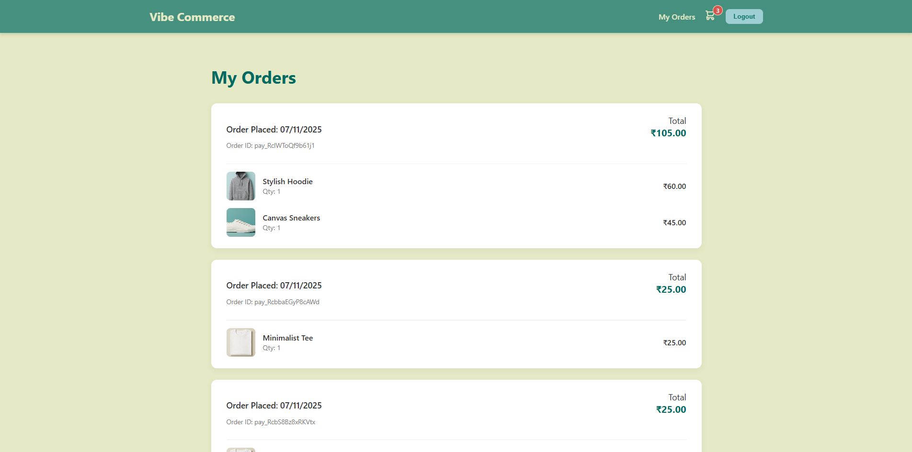

# Vibe Commerce — Full-Stack E-Commerce Cart




A **robust, full-stack shopping cart application** designed to demonstrate **scalable, real-world e-commerce architecture**.
This project implements **advanced security**, **transactional integrity**, and **optimized performance** using modern technologies.

> **Project Status:** Feature Complete (MVP)

---

## Architecture & Low-Level Design (LLD)

This application follows a **microservice-inspired monorepo** structure — separating the presentation layer from business logic — and leverages key architectural patterns for scalability and maintainability.

| Layer              | Technology            | Key LLD Concepts                                                                                                     |
| ------------------ | --------------------- | -------------------------------------------------------------------------------------------------------------------- |
| **Frontend**       | React (Vite)          | Context API for global state, CSS Modules for scoped styling, Glassmorphism UI, framer-motion for scroll animations. |
| **Authentication** | Node.js (Passport.js) | OAuth 2.0 (Sign in with Google), JWT for stateless session management.                                               |
| **Backend**        | Node.js (Express)     | RESTful API design, Middleware protection, clean modular routes.                                                     |
| **Database**       | PostgreSQL (NeonDB)   | Connection pooling for concurrency, Transactional Integrity (BEGIN/COMMIT/ROLLBACK) for safe stock updates.          |
| **Payments**       | Razorpay              | Server-to-server signature verification for fraud prevention, stock reduction after successful payment.              |
| **Optimization**   | In-Memory Caching     | Cache invalidation strategy (`clearProductCache`) ensures real-time stock consistency.                               |

---

## Project Structure

```
/VibeCommerce-Cart/
├── /backend/
│   ├── config/             # Passport.js setup
│   ├── db/                 # PostgreSQL pool connection
│   ├── middleware/         # JWT auth middleware
│   ├── routes/             # API endpoints (cart, products, payment)
│   └── server.js           # Express entry point
├── /frontend-vite/
│   ├── src/
│   │   ├── api.js          # Centralized Axios instance with JWT interceptor
│   │   ├── components/     # Reusable UI (Navbar, ProductCard, etc.)
│   │   ├── context/        # Auth & Cart state management
│   │   └── pages/          # Views (Home, Cart, Orders)
│   └── index.html          # Entry point (includes Razorpay script)
└── README.md
```

---

## Setup & Installation

### Prerequisites

* Node.js (LTS recommended) & npm
* PostgreSQL database (e.g., NeonDB)
* Google OAuth 2.0 Client ID & Secret
* Razorpay Key ID & Secret (Test Mode)

---

### **Step 1: Database Initialization**

1. Create a new database (e.g., `vibe_commerce`) on **NeonDB**.
2. Run your schema manually in the NeonDB SQL Editor to create and seed:

   * `users`
   * `products`
   * `cart_items`
   * `orders`
   * `order_items`

> This approach bypasses local pathing issues during first-time setup.

---

### **Step 2: Configure Environment Variables**

Create a `.env` file in the root directory (`/VibeCommerce-Cart/`):

```env
# --- DATABASE ---
DATABASE_URL="postgresql://YOUR_NEONDB_CONNECTION_STRING_HERE"

# --- BACKEND KEYS ---
JWT_SECRET="a_very_strong_and_long_random_secret_key"

# Razorpay Secret Keys (server-side verification)
RAZORPAY_KEY_ID="rzp_test_XXXXXXXXXXXXXX"
RAZORPAY_KEY_SECRET="XXXXXXXXXXXXXXXXXXXXXXXXXXXX"

# --- GOOGLE OAUTH ---
GOOGLE_CLIENT_ID="YOUR_GOOGLE_CLIENT_ID"
GOOGLE_CLIENT_SECRET="YOUR_GOOGLE_CLIENT_SECRET"
CALLBACK_URL="http://localhost:3001/api/auth/google/callback"

# --- CLIENT (Frontend) ---
CLIENT_URL="http://localhost:5173"
VITE_RAZORPAY_KEY_ID="rzp_test_YOUR_PUBLIC_KEY_ID"
```

---

### **Step 3: Run the Application**

| Terminal    | Path             | Command                       | Description                               |
| ----------- | ---------------- | ----------------------------- | ----------------------------------------- |
| Backend  | `/backend`       | `npm install` → `npm run dev` | Starts Express API server on port `3001`. |
| Frontend | `/frontend-vite` | `npm install` → `npm run dev` | Starts React app on port `5173`.          |

---

## Key Features

### 1. Product Listing & Real-Time Stock

* **Frontend:** Minimalist design with Vibe Commerce palette.
* **Backend:** Dynamic "Only X left!" alerts when stock < 10.

### 2. Scalable Cart Management

* **Endpoints:**

  * `POST /api/cart` → Add item or increase quantity.
  * `POST /api/cart/decrease` → Reduce quantity or remove item.
* **Integrity:** Quantity logic ensures no orphaned rows in `cart_items`.

### 3. Secure Checkout & Order History

* **Transactional Logic:**

  1. Create permanent `order` record.
  2. Store purchased items in `order_items`.
  3. Reduce stock in `products`.
  4. Clear product cache to sync UI instantly.

---

## Authentication Flow

The app employs a **hybrid authentication system** combining OAuth 2.0 and JWT:

1. **Delegated Identity (OAuth 2.0):**
   “Sign in with Google” triggers Passport.js, leveraging Google’s secure identity services.
2. **JWT Tokenization:**
   Backend issues a signed JWT containing the user ID — sent to the client and stored locally.
3. **Protected Routes:**
   Every API request (e.g., `/api/cart`, `/api/orders`) includes this JWT in the `Authorization` header.
4. **Scalability:**
   Stateless sessions eliminate server lookups, enabling seamless horizontal scaling.

---

## Future Enhancements

* Add product search & filtering
* Implement WebSocket-based stock sync
* Introduce Admin Dashboard (CRUD for products)
* Support multiple payment gateways (Stripe, PayPal)

---

## Tech Stack Summary

| Category   | Technology                               |
| ---------- | ---------------------------------------- |
| Frontend   | React (Vite), Context API, Framer Motion |
| Backend    | Node.js, Express, Passport.js            |
| Database   | PostgreSQL (NeonDB)                      |
| Payment    | Razorpay                                 |
| Auth       | Google OAuth 2.0 + JWT                   |
| Deployment | Vercel / Render (suggested)              |

---

## Author

**Vibe Commerce** — A demonstration of **modern, scalable full-stack architecture** for e-commerce.
---